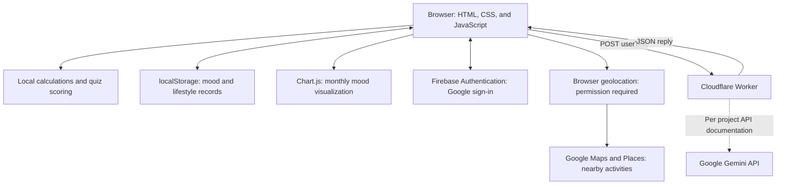

# Health+

A browser-based wellness app that brings physical wellness, emotional well-being, and everyday habit building into one welcoming space.

## Overview

Health+ makes everyday wellness easier to explore without focusing solely on numbers and targets. It pairs practical health calculations with mood reflection and supportive interaction, encouraging users to notice both their physical routines and how they feel.

Through a Traditional Chinese interface, users can estimate BMI and daily energy needs, complete a health quiz, record lifestyle habits, find nearby activity spaces, and write to an AI-supported mailbox. A calm visual style and simple navigation bring these tools together in one website.

### Project Highlights

- **Physical and emotional wellness in one experience:** Connects body measurements, everyday habits, and emotional reflection through a shared interface.
- **Multiple services working together:** Integrates Google Maps and Places for activity discovery, Firebase Authentication for Google sign-in, Chart.js for mood visualization, and a Worker-backed AI mailbox.
- **Separation of browser and AI service access:** The frontend sends messages to a Cloudflare Worker instead of calling the AI provider with a private key in browser code.

### A Typical User Journey

Start with the health quiz to reflect on recent habits, then explore the BMI and TDEE calculator for numerical estimates. Record a mood, hydration level, or exercise category on the calendar and review the monthly mood distribution. For a next step, discover a nearby park or gym, or write to the mailbox for a supportive interaction.

## Live Demo

[Explore Health+](https://ariel-hub-121.github.io/Health/)

Use a modern browser and allow location access to discover nearby activity spaces. Maps, Google sign-in, and mailbox replies require an internet connection and available external services.

## Screenshots

### Homepage

A welcoming starting point with feature shortcuts and wellness quotes.

<!-- Add the Health+ homepage screenshot here -->

### BMI & TDEE Calculator

Body measurements and activity inputs lead to calculated estimates and tailored feedback.

<!-- Add the BMI & TDEE calculator screenshot here -->

### Health Quiz

Eight questions guide users through a reflection on their recent habits and well-being.

<!-- Add the health quiz screenshot here -->

### Mood and Lifestyle Calendar

Daily mood, hydration, and exercise selections appear alongside a monthly mood summary.

<!-- Add the mood and lifestyle calendar screenshot here -->

### Nearby Activity Finder

A location-based map and place cards help users explore nearby activity spaces.

<!-- Add the nearby activity finder screenshot here -->

### AI Support Mailbox

Users can write about their day and receive a supportive reply.

<!-- Add the AI support mailbox screenshot here -->

## Key Features

- **BMI and TDEE calculator:** Calculates BMI from height and weight, and estimates BMR and TDEE using age, sex, and activity level. Results include feedback selected according to BMI and activity inputs.
- **Eight-question health assessment:** Covers exercise, sleep, mental well-being, diet, and hydration, with a score-based summary and predefined lifestyle suggestions.
- **Mood and lifestyle calendar:** Records one of six moods, a water-intake category, and an exercise-intensity category for each selected day.
- **Monthly mood visualization:** Uses a Chart.js doughnut chart to summarize mood frequencies, accompanied by predefined reflections based on the most frequently recorded moods.
- **Water-intake suggestion calculator:** Estimates a daily water-intake range from body weight.
- **Nearby activity discovery:** Combines browser geolocation, Google Maps JavaScript API, and Places API to search within approximately 2.5 km for gyms, sports centers, stadiums, and parks. Place cards show available ratings, opening status, approximate distance, and links to Google Maps.
- **AI support mailbox:** Sends a written message to a Cloudflare Worker and displays the returned reply, with loading and error states.
- **Google sign-in and sign-out:** Uses Firebase Authentication to manage sign-in state and display a personalized greeting.
- **Responsive navigation:** Includes a collapsible sidebar, flexible layouts, and mobile-specific styling.
- **Daily wellness quotes:** Randomly selects a predefined quote for the current morning, afternoon, or evening period when the homepage is opened.

## How It Works

### System Architecture



The solid connections reflect frontend code. The dotted connection reflects the AI integration described in project documentation; the Worker source is not included in this repository.

### Application Flow

The browser runs the HTML, CSS, and JavaScript frontend. Calculations, quiz scoring, and calendar summaries run locally; lifestyle records are saved in browser `localStorage`. Firebase Authentication handles Google sign-in, while Google Maps and Places provide the map and nearby search results using the browser's location permission.

The mailbox sends a JSON message to a Cloudflare Worker and displays its returned `reply`. Project API documentation identifies Google Gemini API as the service behind the Worker and describes the AI key as stored on the Worker side, keeping it out of the current frontend. The Worker source is not included in this repository, so its model and deployed configuration cannot be independently verified here.

### Implementation Notes

- **Single-page interaction:** JavaScript switches between feature sections without loading a separate HTML page. The sidebar closes after navigation, and forms display results within the current view.
- **Local feedback:** Calculator results depend on entered measurements and activity level; quiz feedback depends on the total score. Monthly reflections are assembled from predefined text for the most frequently recorded moods.
- **External requests:** Location access starts when the user requests nearby places. Mailbox submission checks for nonempty text, shows a loading state, and displays either the returned reply or a fallback message.
- **Independent sign-in and storage:** Firebase updates the greeting and login controls, while calendar records remain in browser storage. Authentication currently does not connect those records to a cloud account.

## Tech Stack

### Frontend

- HTML5
- CSS3
- Vanilla JavaScript
- Responsive Web Design

### Libraries

- Chart.js
- Lucide Icons

### Services and APIs

- Google Maps JavaScript API
- Google Places API
- Browser Geolocation API
- Firebase Authentication
- Cloudflare Workers
- Google Gemini API (identified in project API documentation; accessed through the Worker)

## Data Storage

Mood, water-intake, and exercise records are stored in browser `localStorage`. They are specific to the browser, device, and site origin, and are not synchronized through the signed-in Google account. Switching accounts in the same browser does not create a separate set of records. Clearing browser data may remove them.

Mailbox messages are sent to the external Worker for processing. The repository does not establish the backend's message-retention policy.

## Security Considerations

- Keep the private AI API key behind the Cloudflare Worker. The current frontend calls the Worker without embedding an AI key; the exact backend storage configuration requires verification outside this repository.
- Restrict Google Maps access to authorized HTTP referrers and required APIs, with quotas and billing alerts configured for the project.
- Configure authorized domains for Firebase sign-in. Frontend-visible Firebase configuration and Maps identifiers are not secret credentials; protection depends on service restrictions and appropriate access rules.
- Never commit private API keys or secret values to the repository.
- Treat CORS as a browser access policy, not as authentication or a complete abuse-prevention mechanism. Backend authentication, validation, and rate limiting require separate implementation and verification.

These configuration recommendations do not establish that every protection is enabled in the deployed services.

## Run Locally

1. Clone the repository:

   ```sh
   git clone https://github.com/ariel-hub-121/Health.git
   ```

2. Open the project directory:

   ```sh
   cd Health
   ```

3. Start a local development server, such as VS Code Live Server, serving `index.html`.
4. Open the generated localhost URL in a modern browser.

No build step is required. For Google sign-in and maps, the local hostname may need to be added to Firebase authorized domains and the local URL to Google Maps HTTP referrer restrictions. Use your own service configuration when running an independent copy; the original project's restrictions may prevent these integrations from working locally.

## Current Limitations

- Lifestyle records remain in `localStorage`, without account-based storage or cross-device synchronization.
- Firestore is imported and initialized but is not currently used for application data storage.
- The frontend does not require sign-in or attach a Firebase ID token when submitting mailbox messages, so the endpoint may allow guest access. It checks for nonempty text but does not enforce a message-length limit.
- Project API documentation reports guest access and no server-side authentication, input-length limits, or rate limiting. The Worker source is absent, so the current deployment's protections remain unverified.
- HTML, CSS, and JavaScript are contained in a single large `index.html`.
- Calculator feedback, quiz results, and monthly mood reflections use predefined rules and text; they are not AI-generated assessments.

## Future Improvements

- Synchronize authenticated users' lifestyle records through Firestore, with Security Rules designed around the actual data model.
- Add Firebase App Check for supported Firebase resources.
- Validate Firebase ID tokens in the Worker if mailbox access becomes account-based.
- Review the Worker and add or strengthen server-side input validation, request-size limits, and rate limiting as needed.
- Separate HTML, CSS, and JavaScript into maintainable modules.
- Add automated tests and improve keyboard navigation, form labeling, and accessibility.

## My Contributions

### Ariel Lynn Lee

The website's team section credits Ariel Lynn Lee with interface and interaction work. The following contribution outline is a draft for individual confirmation before portfolio publication.

<!-- Confirm and edit individual contributions before publishing -->

- Participated in requirement analysis and feature planning for the wellness tools.
- Designed user interfaces and interactions to support a consistent experience across feature sections.
- Implemented BMI and TDEE calculations, input checks, and result feedback.
- Developed the eight-question health quiz, navigation, scoring, and result presentation.
- Wrote user-facing content, feature explanations, and wellness suggestions.
- Assisted with debugging and API integration across the application's features.
- Collaborated through Git to coordinate and integrate project changes.

## Team

- Ariel Lynn Lee
- Chen Yin Ju

## Disclaimer

Health+ provides general wellness information and supportive interaction only. Its calculations and suggestions do not replace medical, nutritional, or mental-health advice. Consult qualified professionals when needed.
